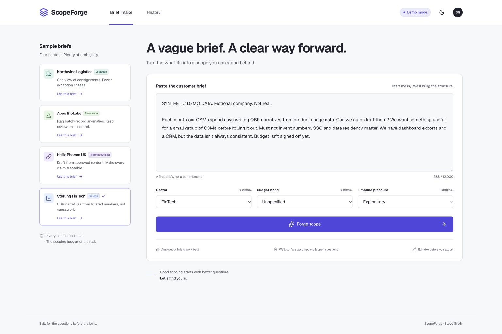
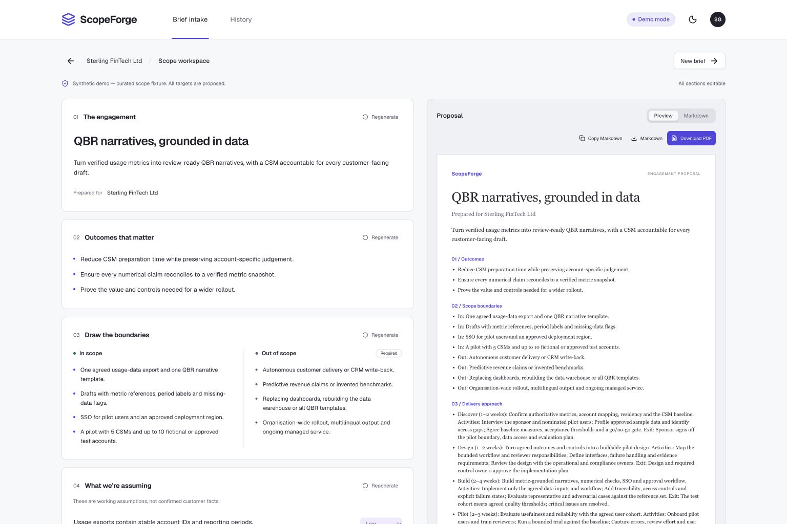
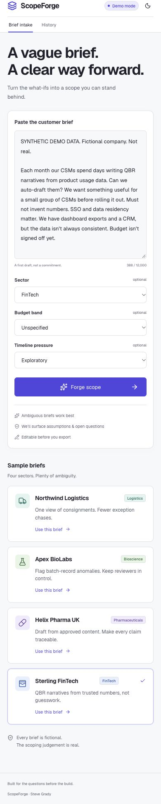
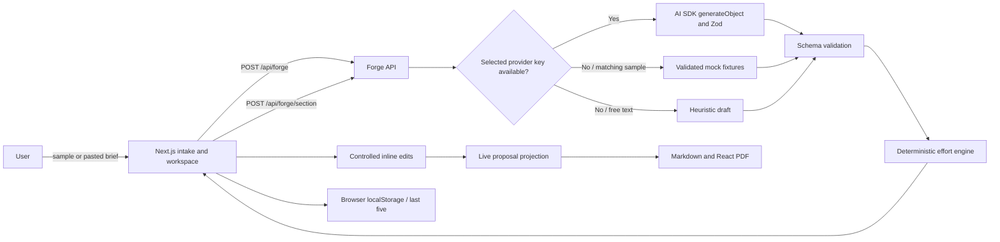

# ScopeForge

Paste a vague customer brief. Get goals, assumptions, open questions, phased scope, a planning estimate and a proposal you can put in front of a buyer.

  

**[Live demo](https://scopeforge-sable.vercel.app/)** · [GitHub](https://github.com/ZeroCool0388/scopeforge) · Built by [Steve Grady](https://github.com/ZeroCool0388) · [LinkedIn](https://www.linkedin.com/in/steve-jg)



## Problem

Vague briefs waste pre-sales cycles. Scoping varies between people, assumptions become accidental commitments, and open questions get missed until they turn into blockers. A useful first draft should make uncertainty visible and give a buyer a clear next decision.

## What it does

- Forges four carefully authored fictional sector briefs, or a brief you paste yourself.
- Makes outcomes, scope boundaries, confidence-rated assumptions and four question groups explicit.
- Proposes five delivery phases with exit criteria and a reproducible person-week range.
- Lets you edit every section and regenerate one section while keeping other edits.
- Exports Markdown or a PDF attributed to Steve Grady, and keeps the last five drafts in your browser.

## Demo

<!-- GIF placeholder: replace with a recording of the script below. -->

`docs/demo.gif` — recording placeholder; use the walkthrough below.




[Open the sample one-page proposal](docs/sample-proposal.pdf).

**60–90 second demo script**

1. **0–10 s:** “Most ‘AI projects’ fail at scoping. This turns a vague brief into a plan you could take to a customer.”
2. **10–25 s:** Select Sterling FinTech, click **Forge scope**, and narrate the six progress stages.
3. **25–50 s:** Walk through Goals → Out of scope (mandatory) → Assumptions with confidence → Open questions grouped by Commercial, Technical, Operational and Compliance.
4. **50–70 s:** Show phases and their exit criteria, then the effort band and drivers. Edit the Commercial question and watch the proposal update.
5. **70–90 s:** Click **Download PDF**. “Same judgement a solutions consultant brings — just faster to a first draft.”

No API key is needed. The FinTech brief is preloaded. All numbers and targets are fictional or proposed.

## How to run

The dev server runs at **[http://127.0.0.1:3033](http://127.0.0.1:3033)**.

Node **20.9+** and npm are required.

```sh
npm install && npm run dev
```

A fresh clone runs in demo mode with no `.env`.

```sh
npm run build
npm run start
npm run lint
npm run typecheck
npm run test
npx playwright install chromium
npm run test:e2e
```

**Vercel:** the public demo is deployed at [scopeforge-sable.vercel.app](https://scopeforge-sable.vercel.app/) and connected to this repository's `main` branch. Pushes to `main` deploy production updates automatically. The project uses the detected Next.js preset and default build settings. No database or additional Vercel configuration is required. The data files are included through Next.js output tracing. API keys are unset so the public portfolio runs in demo mode.

For your own deployment, import the repository into Vercel and use the detected defaults.

## Demo mode vs live mode

Copy `.env.example` to `.env.local` only if you want live generation. Set values locally, never in the browser or source code:

| Variable             | Purpose                                                                                                  |
| -------------------- | -------------------------------------------------------------------------------------------------------- |
| `LLM_PROVIDER`       | `openai` or `anthropic`. If empty, selects the provider with an available key; OpenAI takes precedence.  |
| `OPENAI_API_KEY`     | Server-only OpenAI key.                                                                                  |
| `ANTHROPIC_API_KEY`  | Server-only Anthropic key.                                                                               |
| `LLM_MODEL`          | Optional provider-compatible model ID. Defaults to `gpt-4.1-mini` or `claude-sonnet-4-5`.                |
| `FORGE_ACCESS_TOKEN` | Optional request gate for a live deployment. Enter it in the intake form; it is never stored in history. |

Restart the dev server after changing variables. The header reports the configured mode; a workspace reports the mode that actually produced its current scope. An explicit demo fallback remains labelled **Demo mode**, even when a live provider is configured.

- **Matching sample:** a validated, deterministic fixture. Section refresh cycles the alternate fixture for that section only.
- **Free-text demo:** sentence extraction, transparent stock assumptions and questions, and keyword-based effort drivers. The result is clearly labelled “Demo mode — heuristic draft. Add an API key for a full AI forge.” It is a starting point, not real model reasoning.
- **Live:** Vercel AI SDK `generateObject`, provider-specific SDKs, a bounded request and strict Zod output validation. Brief content is treated as untrusted input. Provider errors offer demo output; no silent switch misrepresents generated content.

Demo progress is shown for at least 2.7 seconds. Live requests have a 45-second provider timeout, at most one SDK retry and a best-effort per-instance limit of five requests per minute. The optional gate is additional protection, not a replacement for provider spend limits or platform rate limiting. All API keys remain server-side. Raw provider errors and prompts are not logged or returned.

Authenticated OpenAI and Anthropic requests have not been verified here because provider credentials are absent. Both adapters, deterministic effort recomputation and failure/fallback behaviour are covered with mocked provider tests.

## Architecture



The server owns provider access and data fixtures. The client owns edits, the proposal preview, Markdown exports and browser history. A server route renders PDF exports. Full generation and section regeneration share the same schema and effort engine. Regeneration returns a validated scope, but the client replaces only the requested fields, preserving edits made in other sections while the request was in flight.

`lib/schema.ts` defines the contract, `lib/forge.ts` orchestrates generation, `lib/effort.ts` computes work ranges, and `lib/proposal.ts` projects customer-ready proposal content. PDF rendering happens on demand in a Node server route, avoiding browser-specific renderer limitations. There are no accounts, database, external connectors, emails or CRM writes.

## How effort is estimated

Effort measures **person-weeks of work**, not elapsed calendar time and not a currency quote. Phase durations describe the delivery sequence; staffing and dependencies determine the calendar.

| Size   | Base person-weeks |
| ------ | ----------------- |
| Small  | 3–5               |
| Medium | 6–10              |
| Large  | 12–20             |

| Unique driver  | Added person-weeks |
| -------------- | ------------------ |
| Integrations   | 2–4                |
| Data readiness | 1–3                |
| SSO            | 1–2                |
| Compliance     | 2–4                |
| Residency      | 1–2                |
| Human review   | 1–2                |

`minimum = base minimum + sum(unique driver minima)`; `maximum = base maximum + sum(unique driver maxima)`.

Driver descriptions explain the uncertainty; they do not multiply the adder by system count. Duplicate IDs are counted once. Removing or adding a driver, or changing the engagement size, updates the band immediately. The LLM chooses size and drivers; it never controls the numerical range.

For Sterling FinTech: Medium `6–10` + integrations `2–4` + data readiness `1–3` + SSO `1–2` + residency `1–2` + human review `1–2` = **12–23 person-weeks**. The configuration lives in `data/effort-model.json`; the same explanation appears in the workspace.

## What I'd tell a customer

“We can get to a scoped proposal faster while keeping the difficult questions visible. Explicit out-of-scope boundaries, assumptions and open questions reduce surprises during delivery. A human still owns the commercial judgement and confirms the proposed targets. Let’s pilot it on the next five inbound briefs, compare time to a usable first proposal, and review whether the questions and boundaries improved.”

## Roadmap

- CRM push after human approval.
- Jira/Linear export for agreed delivery phases.
- Proposal templates by sector.
- Multi-language proposals.
- A win/loss feedback loop with appropriate privacy controls.

## Data & disclaimer

All sample customers, briefs, scenarios and figures are fictional. Every source brief starts with `SYNTHETIC DEMO DATA. Fictional company. Not real.` No real customer records or confidential proposals are used. Any future fictional contact addresses must use `.example` domains.

The author identity, Steve Grady, is the intended public attribution. Generated proposals include “Synthetic demo — fictional customer.” Targets are proposed, assumptions require discovery, and effort is a planning range, not a quote. This portfolio app does not certify regulatory compliance or make release, medical or financial decisions.

History is stored locally in the current browser, capped at five entries, and clearable. Drafts sent to live mode are processed by the configured provider. Use synthetic input for this demo. No credentials are stored in history.

PDF exports use A4 with page-break-aware text. The seeded proposals are designed for a single page; unusually long edits can continue onto additional pages so content is preserved. The live preview includes the same proposal sections as the Markdown/PDF; phase activities and exit criteria are included in the exports.

The supplied local build brief is preserved but excluded from Git because it contains names excluded from the public demo. `.env*` is ignored except `.env.example`.

## Licence

[MIT](LICENSE) · Copyright © 2026 Steve Grady.
